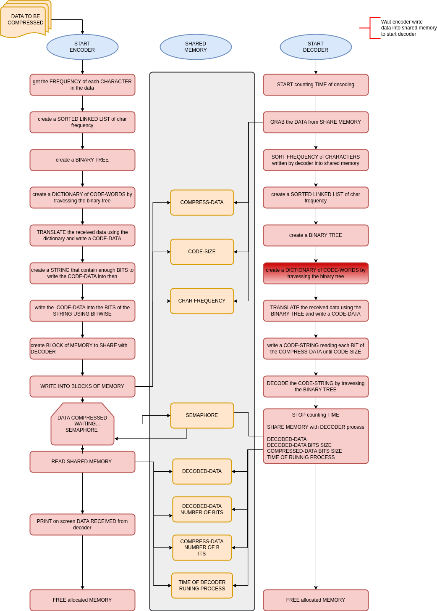
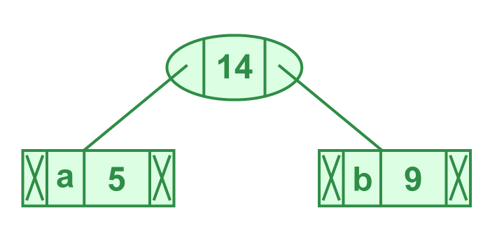
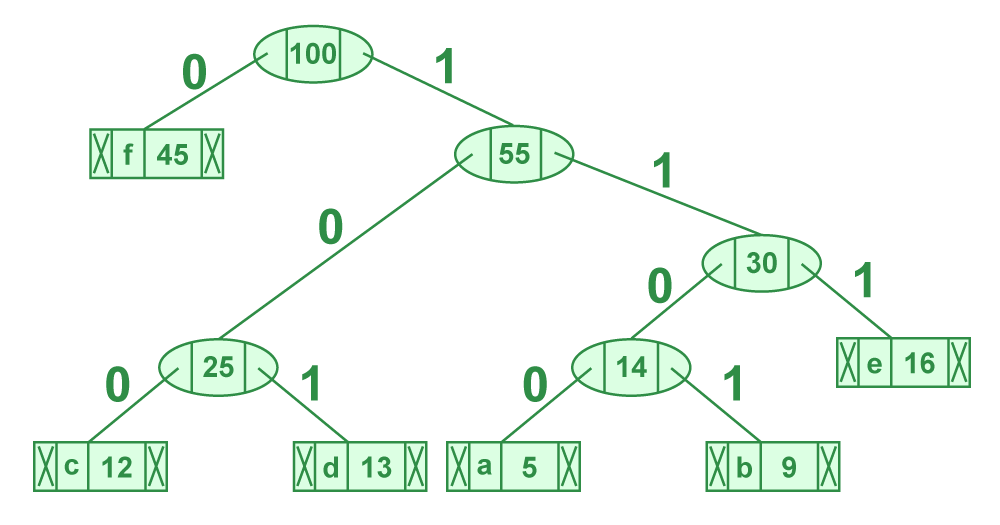
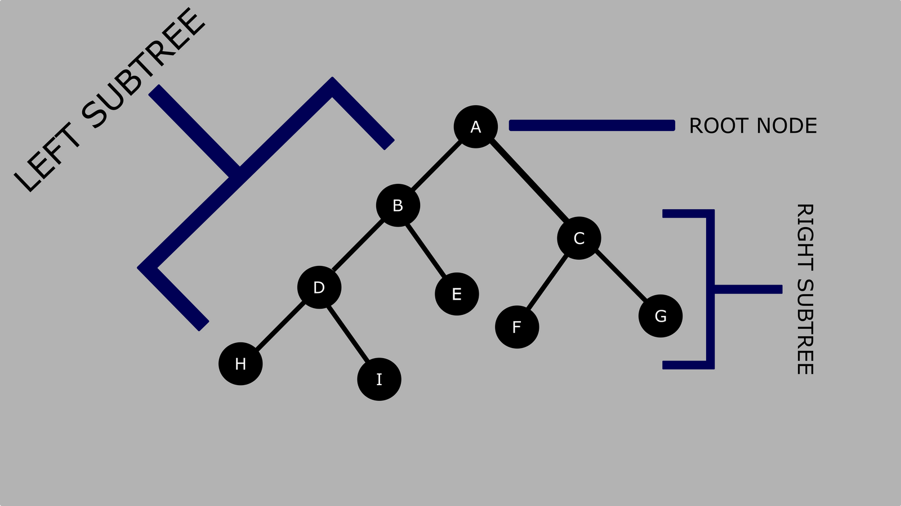
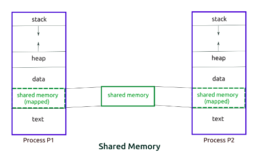
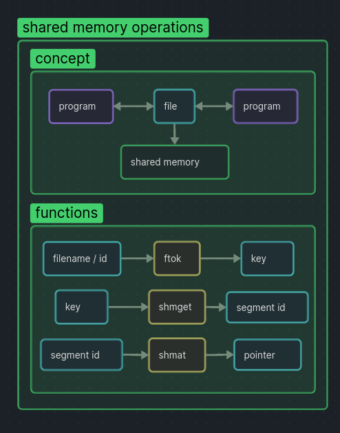

## Usage

 

<ul>
<li>Clone the repository into you computer</li>
<li>Open two terminals:</li>
<ul>
<li><dt>first terminal</dt><dd>in the root of the program enter into 
<mark>./encoder_files</mark></dd></li>
<li><dt>second terminal</dt><dd>in the root of the program enter into 
<mark>./decoder_files</mark></dd></li>
</ul>
<li>Run the command 'make' into both terminals to compile the programs</li>
<li>First run the binary <mark>./encoder &ltfile&gt</mark> <file to compress> 
and press enter</li>
<li>Wait for the message 
<pre><code>"DATA COMPRESSED".</code></pre>
</li>

<li>Now, on the second terminal run the binary <mark>./decoder</mark>.</li>
<li>The follow information will be written into the first terminal</li>
<pre>
<code>
DADO DESCOMPRIMIDO:             &ltdata&gt
TOTAL DE BITS:                  &lttotal&gt
TOTAL BITS COMPRIMIDOS:         &ltbits comprimidos&gt
TOTAL OPERAÇÃO DESCOMPREÇÃO:    &lttempo&gt
</code>
</pre>
</ul>

### other commands

<dl>
<dt>make re</dt><dd>recompile all the files</d>
<dt>make fclean</dt><dd>clean all the files compiled</d>
</dl>

### Dependencies

gcc compiler

sys/ipc.h and sys/shm.h libraries for shared memory usage

 

## How the program works

 

 

## What is a Huffman Algorithm?

 

Huffman coding is a lossless data compression algorithm. The idea is to assign
variable-length codes(bit sequence) to input characteres. Lengths of the 
assigned codes are based on the frequencies of corresponding characters. Higher 
is the frequency shorter is the length of the code representing the 
character

A character has 8 bits. The Huffman algorithm transform the 8 bits sequence 
that represents a character in a smaller sequence of bits, making the hole 
archive smaller.

<code>

Original bit in memory representing the sequency of caracters:

<pre>
0100000101000010010100100100000101000011000000101000100010000010010000100101001
00100000100100001
A       B       R       A       C       A       D       A       B       R       
A       !
</pre>

After compressing:

<pre>
011111110011001000111111100101 
A  B  R  A  C  A  D  A  B  R  A  !
</pre>
</code>

The variable-length codes assigned to input characters are 
<b>Prefix Codes<b>, means that any variable-length code (bit sequences) assigned
to a character is equal to the prefix(initial segment) of code assigned to any 
other character. This is how Huffman Coding makes sure that there is no 
ambiguity when encoding the generated bitstream.

 

## ENCODER

 

### <b>Main parts in Huffman Coding</b>

<ul>
<li>Build a Huffman Tree from input characters.</li>
<li>Traverse the Huffman Tree and assign codes to characters(make a dictionary).
</ul>
 

### <b>Steps to built Huffman Tree</b>

 

Input is an array of unique characters along with their frequency of 
occurrences and output is Huffman Tree

 Read the text and generate two arrays, one with the characters and other 
with the frequency that wich one appears in the text.

<code>
<pre>
char arr[] = { 'a', 'b', 'c', 'd', 'e', 'f' };
int freq[] = { 5, 9, 12, 13, 16, 45 };
</pre>
</code>
<ol>
<li>Create a leaf node for each unique character that appear in the text and 
built a linked list of all leaf nodes. The linked list is used as a priority 
queue, the value of frequency field is used to compare two nodes. Initially, 
the least frequent character is at root</li>
<code>
<pre>
character   Frequency
    a            5
    b            9
    c           12
    d           13
    e           16
    f           45
</pre>
</code>
<li>Extract two nodes with minimum frequency from the min heap.</li>
<code>
<pre>
character   Frequency
    a            5
    b            9
</pre>
</code>
<li>Create a new internal node with a frequency equal to the sum of the two 
nodes frequencies. Make the first extracted node as its left child and the other
 as its right child.</li>
<code>
<pre>
5 + 9 = 14
</pre>
</code>

<li>Add this node to the min heap</li>
<code>
<pre>
character   Frequency
    c           12
    d           13
    node        14
    e           16
    f           45
</pre>
</code>
<li>Repeat steps 2 and 3 until the heap contains only one node. The remaining 
node is the root node and the tree is complete.</li>
</ol>
 
 

## <b>Steps to built the Dictionary</b>

 

The new bynary codes that will represent the characters are going to be 
built traversing the Huffman tree. Traverse to left will join a 0 to the code 
of the char and travessing to right will join a 1 to the code of the char

<code>
<pre>
character   code-word
    f          0
    c          100
    d          101
    a          1100
    b          1101
    e          111
</code>
</pre>
 

In order to genarate a prefix code, the tree will be traversed in a Preorder 
way.

 

### <b>Tree Traversals (Inorder, Preorder and Postorder)</b>

 

Unlike liner data structures (array, Linked List, Stacks, etc) which have 
only one logical way to traverse, trees can be traversed in different ways.

The prefixs IN, PRE and POST tells us when we are going to visit the node 
that we are.

<ul>
<li>Inorder (node->left, root, node->right)</li>
<li>Preorder (root, node->left, node->right)</li>
<li>Postorder (node->left, node->right, root)</li>
</ul>
 

 

### <b>Inorder</b>

 

Is commonly used on binary serch trees bacause returns values from underlying
set in order, according to the comparator that set up the binary tree.

The result of a Inorder traverse is always a ordered sequence.

<ul>
<li>Traverse the left subtree; call Inorder(left->subtree)</li>
<li>Visit the root</li>
<li>Traverse the right subtree; call Inorder(right->subtree)</li>
</ul>

<pre>
<code>
void Inorder(struct Node* node)
{
    if (node == NULL)
        return;

    /* first recur on left child */
    Inorder(node->left);
    
    /* then print the data of node */
    cout << node->data << " ";
    
    /* now recur on right child */
    Inorder(node->right);
}
</code>
</pre>
 

### <b>Preorder</b>

 

Best use for duplicate a binary tree
 

Used to make a prefix expression.

<ul>
<li>Visit the root</li>
<li>Traverse the left subtree; call Preorder(left->subtree</li>
<li>Traverse the right subtree; call Preorder(right->subtree)</li>
</ul>

<pre>
<code>
void Preorder(struct Node* node)
{
    if (node == NULL)
        return;
 
    /* first print data of node */
    cout << node->data << " ";

    /* then recur on left subtree */
    Preorder(node->left);
 
    /* now recur on right subtree */
    Preorder(node->right);
}
</code>
</pre>
 

### <b>Postorder</b>

 

best use for deleteting or freeing nodes. Can delete or free an entire 
binary tree.

It can also generate a postfix expression

<ul>
<li>Traverse the left subtree; call Postorder(left->subtree)</li>
<li>Traverser the right subtree; call Postorder(right->subtree)</li>
<li>Visit the root</li>
</ul>

<pre>
<code>
void Postorder(struct Node* node)
{
    if (node == NULL)
        return;
 
    // first recur on left subtree
    Postorder(node->left);
 
    // then recur on right subtree
    Postorder(node->right);
 
    // now deal with the node
    cout << node->data << " ";
}
</code>
</pre>

 

## <b>Encode data</b>

 

The Encode data will be a string with the text of the file were which 
caracter is substituted by its respective code-word.

The encoding code will pass through each character of the text and
substitute by its code-word.

 

## <b>Compact data</b>

The compact data will be a string which the sequence of bits is manipulated 
to be equal to the encode data.

So, the size in bits of the compact data, will be the number of characters 
of the encode data, much smaller than the size in bits of the original text, 
imagining that each char has 8bits size.

In order to manipulate the bits of the compact data, will be necessary to 
make operations with then.

 

### <b>Bitwise Operation</b>

 

### Operator Move Left (<<)
 

<pre>
<code>
b = a << n;
</code>
</pre>

a = 1..............0001 = 1

b = a << 1.....0010 = 2

c = a << 2.....0100 = 4

d = a << 2.....1000 = 8

The operation going to, into the var 'a' chain of bits, remove the most 
significant bit in the left and add a bit 0 in the right. This operation will 
be done n times.

 

### Operator Move Right (>>)

 

<pre>
<code>
b = a >> n;
</code>
</pre>

a = 10.............1010 = 10

b = a >> 1.....0101 = 5

c = a >> 2.....0010 = 2

d = a >> 2.....0001 = 1

The operation going to, into the var 'a' chain of bits, remove the least 
significant bit in the right and add a bit 0 in the left. This operation will 
be done n times.

 

### Operator NOT (~)

 

<pre>
<code>
b = ~a ;
</code>
</pre>

a = 1..........0001 = 1

b = ~a......1110 = -2

c = 3.........0011 = 3

d = ~c.....1100 = -4

The operation will invert every bit into the var 'a' chain of bits.

 

### Operator AND (&)

 

<pre>
<code>
c = a & c ;
</code>
</pre>

a = 30..........0000.0000.0001.1110

b = 19...........0000.0000.0001.0011

c = a & b.......0000.0000.0001.0010

The operation will follow the table bellow:

A.....B.....A&B

0......0........0

0......1........0

1......0........0

1......1........1

This operator is used to check if the bit is true.

a = 73........................0000.0000.0100.1001

b = 1 << 3..................0000.0000.0000.1000

c = a & (1 << 3);........0000.0000.0000.1000

 
 
If b is equal to c, it means that the bit is equal to true

 

### Operator OR (|)

 

<pre>
<code>
c = a | b;
</code>
</pre>

a = 30..........0000.0000.0001.1110

b = 19...........0000.0000.0001.0011

c = a | b.......0000.0000.0001.1111

The operation will follow the table bellow:

A.....B.....A&B

0......0........0

0......1........1

1......0........1

1......1........1

This operator is used to change the value of a bit to true.

a = 73........................0000.0000.0100.1001

b = 1 << 2..................0000.0000.0000.0100

c = a | (1 << 2);........0000.0000.0100.1101

 

After the operation only the right third bit changed that as 0, 
changed to 1.

 

 ### Operator OR Exclusive (^)

 

<pre>
<code>
c = a ^ b;
</code>
</pre>

a = 30..........0000.0000.0001.1110

b = 19...........0000.0000.0001.0011

c = a ^ b.......0000.0000.0000.1101

The operation will follow the table bellow:

A.....B.....A&B

0......0........0

0......1........1

1......0........1

1......1........0

The result of the operation in the bit will be 0 only if both bit are equal.

 
This operation is used with microcontrolers like arduino to invert the 
state of a bit.

a = 73........................0000.0000.0100.1001

b = 1 << 2..................0000.0000.0000.0100

c = a ^ (1 << 2);........0000.0000.0100.1101

We set the bit 1 in the position of the bit that we want to invert. Any
bit that makes a operation with 1 will invert its value.

In the end of encode process it will be generated a struct with a array with 
the encoded bits, the size of the array and the dictionay. This information will 
be sent to a decoder program generate the original text again.

 

# <b>Shared Memory (IPC)</b>

 

Inter Process Communication through shared memory is a concept where two or 
more precess can access a common memory.

The first process simply writes data into the shared memory segment. As soon 
as it is written, the data becomes available to the second process.

<ul>
<li>Inter-related process communication is usually performed using Pipes.</li>
<li>Unrelated processes(say one process running in one terminal and other 
running in another terminal) communication can be performed using Shared Memory
technique.</li>
</ul>
 

 
 

### <b>Steps to create a shared memory</b>

 

<ul>
<li>Create the shared memory segment or used a already created
shared memory segment(shmget()).</li>
<li>Attach the process to the already created shared memory segment(shmat()).</li>
<li>Write data into the shared memory to the others process read from there<i>
<li>Detach the process from the already attached memory
segment(shmdt()).</li>
<li>Control operations on the shared memory segment (shmct()).</li>
</ul>
 

### Create the Shared Memory

 

First of all our encoder program has to create a memory to the decode 
process access.

#### <b>Creates a Key</b>

To use the IPC mechanism, its is necessary a IPC key. The key can be an 
arbitrary value or it can be generated by the ftok() function.

<code>
<pre>
#include &ltsys/ipc.h&gt
#include &ltsys/types.h&gt

key_t   ftok (const char *pathname, int proj_id);
</pre>
</code>
<dl>
<dt><i>pathname</i></dt><dd> existing file in the filesystem.</dd>
<dt><i>proj_id</i></dt><dd>the last eight bits are used. These must not be 
zero</dd>
</dl>
 

#### <b>Get Shared Memory</b>

The function shmget gets you a shared memory segment associated with the 
given key. The key is obtained earlier using the ftok function. If there is no 
existing shared memory segment corresponding to the given key and IPC_CREAT 
flag is specified in shmflg, a new shared memory segment is created.

<code>
<pre>
#include &ltsys/ipc.h&gt
#include &ltsys/shm.h&gt

int    shmget(key_t key, size_t size, int shmflg);
</pre>
</code>
<dl>
<dt><i>key<dt><dd>obtained by ftok() function.</dd>
<dt><i>size</i></dt><dd>size of the memory segment rounded to multiple of 
PAGE_SIZE.

<dl>
<dt>PAGE_SIZE</dt><dd>it will depends on the pc architecture. To get bigger 
PAGE_SIZE use the flag SHM_HUGETLB. To check PAZE_SIZE in your computer use the 
follow command:

<code><pre>cat /proc/meminfo</pre></code></dd>
</dl>
<dt>shmflg</dt><dd>specifies the required shared memory flag/s
such as:
<dl>
<dt>IPC_CREAT</dt><dd>create a new segment.  If this flag is not used, then 
shmget() will find the  segment associated  with key  and check to see if the 
user has permission to access the segment.</dd>
<dt>IPC_EXCL</dt><dd>(used with IPC_CREAT to create a new segment or call fails 
if the segment already exists).</dd>
</dl>
</dl>

<b>RETURN</b>

A valid memory identifier on sucess or -1 in case of failure

 

### Attach the process to the Shared Memory

 

Map the shared memory block into the process's memory and give a pointer to 
it.

<code>
<pre>
#include &ltssys/types.h&gt
#include &ltssys/shm.h&gt

void    *shmat(int shmid, const void *shmaddr, int shmflg)
</pre>
</code>
<dl>
<dt>shmid</dt> - <dd>The identifier of the shared memory segment</dd>
<dt>shmaddr</dt><dd>specify the attaching address. If is NULL, the system by 
default chooses the suitable address to attache the segment.</dd>
<dt>shmflg</dt><dd>specifies the reuired shared memory flag/s shach as:</dd>
<ul>
<dt>SHM_RND</dt><dd>(if shmaddr not NULL)rounding off address to SHMLBA 
(Segment Low Boundary Address) normaly same size as PAGE_SIZE</dd>
<dt>SHM_EXEC</dt><dd>allows the contents of segment to be executed.</dd>
<dt>SHM_REMAP</dt><dd>replaces the existing mapping in the range specified by 
shmaddr and continuing till the end of segment.</dd>
<dt>0</dt><dd>default.</dd>
</ul>
</ul>

<b>RETURN</b>

The address of attached shared memory segment on successs or -1 in case of 
failure.

 

### Detach the process from the already attached memory

 
<code>
<pre>
#include &ltssys/types.h&gt
#include &ltssys/shm.h&gt

int    shmdt(const void *shmaddr)
</pre>
</code>
<dl>
<dt>shmaddr</dt><dd>is the address of shared memory segment to be dettached. 
The shmaddr must be the address returned by th shmat() system call.</dd>
 

<b>RETURN</b>

Return 0 on success and -1 is case of failure.

### Control operations on the Shared Memory

 
<code>
<pre>
#include &ltssys/types.h&gt
#include &ltssys/shm.h&gt

int    shmctl(int shmid, int cmd, struct shmid_ds *buf)
</pre>
</code>
<dl>
<dt>shmid</dt><dd>identifier of the shared memory.</dd>
<dt>cmd</dt><dd>the command to perform in the shared memory.
<dl>
<dt>IPC_STAT</dt><dd>copies the information of the current values of each 
member of struct shmid_ds to the passed structure pointed by buf. This command 
requires read permission to the shared memory segment.</d>
<dt>IPC_SET</dt><dd>sets the user ID, group ID of the owner, permissions, etc... 
pointed to by structure buf.</dd>
<dt>IPC_RMID</dt><dd>marks the segment to be destroyed. The segment is destroyed 
only after the last process has detached it.</d>
<dt>IPC_INFO</dt><dd>returns the information about the shared memory limits and 
parameters in the structure pointed by buf.</dd>
<dt>SHM_INFO</dt><dd>returns a shm_info structure cotaining information about 
the consumed system resources by shared memory.</dd>
</dl>
<dd>
<dt>buf</dt><dd>is a pointer to the shared memory structure named struct 
shmid_ds. The values of this structure would be used for either set or get as 
per cmd.</dd>
</dl>
 

<b>RETURN</b>

<ul>
<li>IPC_INFO, SHM_INFO of SHM_STAT - returns the index or identifier of the 
shared memory on sucess and -1 in case of failure.</li>
<li>IPC_STAT or IPC_SET - returns 0 on sucess and -1 in case of failure.</li>
</ul>
 

# <b>DECODER</b>

 

Decoder process will make the inverse path of encoder

<ol>
<li>Salve the compact data received from encoder process via memory share into 
apropriate variables.</li>
<ul>
<li>characters frequency</li>
<li>compact data</li>
<li>number of btis to be decoded.</li>
<li>semaphore - A block of memory size of int with value of 0. The value of 0 
will maintain the encoder process in a while structure waiting for the decoder 
process cahnge it.</li>
</ul>
<li>Create a Huffman tree to decode the text sent by encoder process</li>
<ul>
<li>Sort the frequence of characters</li>
<li>Create a list with nodes containig the char and the frequency.</li>
<li>Buit the three.</li>
</ul>
<li>Make the dictionary.</li>
<li>Decode the sent message</li>
<ul>
<li>Walk through the bits of the compact data and traversse the huffman tree 
in paralel</li>
<dl>
<dt>if compact data Bit = 0</dt>
<dd>walk to left-node</dd>
<dt>if compact data Bit = 1</dt>
<dd>walk to right-node
</dl>
<li>If a leaf of the huffman tree is reached the character of the node is write 
in the decoded string.</li>
</ul>
<li>Send the decoded text into a block of shared memory</li>
<li>Finaly, set the semaphore block of shared memory to 1, in order to release 
the encoder process.</li>
</ol>

In the end, the encoder process read the memory sent by the decoder and 
print in the screen.

## <b>Links</b>

#### Traversse Binary tree

https://www.geeksforgeeks.org/tree-traversals-inorder-preorder-and-
postorder/

https://www.freecodecamp.org/news/binary-search-tree-traversal-inorder-preorder-post-order-for-bst/

https://www.youtube.com/watch?v=gm8DUJJhmY4

https://www.youtube.com/watch?v=BHB0B1jFKQc

#### BItwise

https://www.youtube.com/watch?v=qYJteDMUvVg&list=PLqJK4Oyr5WShtxF1Ch3Vq4b1D
zzb-WxbP&index=10

https://www.youtube.com/watch?v=Oafc2Q7Y-mQ&list=PLqJK4Oyr5WShtxF1Ch3Vq4b1D
zzb-WxbP&index=11

https://www.youtube.com/watch?v=VL-HLPOvWZ0&list=PLqJK4Oyr5WShtxF1Ch3Vq4b1Dz
zb-WxbP&index=12

https://www.youtube.com/watch?v=6Xt_rIN3z2Y&list=PLqJK4Oyr5WShtxF1Ch3Vq4b1Dz
zb-WxbP&index=13

#### Shared Memory

https://www.tutorialspoint.com/inter_process_communication/inter_process_communication_shared_memory.htm

https://www.softprayog.in/programming/interprocess-communication-using-system-v-shared-memory-in-linux
